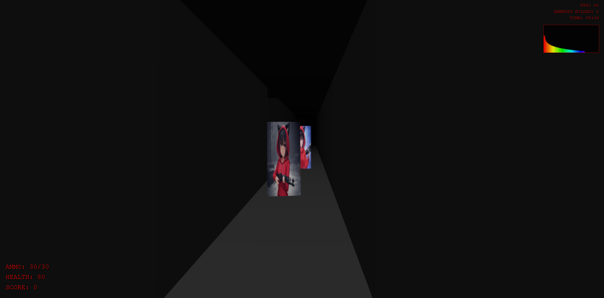

# Anime Doom

## Overview

Anime Doom is a browser-based first-person shooter game inspired by classic FPS games like Doom, with an anime aesthetic twist. The game features:

- Fast-paced shooting gameplay
- Enemy AI with pathfinding and shooting mechanics
- Dynamic audio synthesis for sound effects
- Real-time audio visualization
- Ammo pickups and health management
- Score tracking and game timer

## Play Now

[Play Anime Doom on Github Pages](https://unlimitedbytes.github.io/anime-doom)

## Controls

- **WASD / Arrow Keys**: Movement
- **Mouse**: Look around
- **Left Click**: Shoot
- **Space**: Jump
- **ESC**: Pause game

## Development

This project was created **entirely using the [Augment Code](https://www.augmentcode.com/) VS Code Extension**, which provides AI-assisted coding capabilities. No line of code was written manually - everything from game mechanics to audio synthesis was generated through conversation with the AI assistant.

### Technologies Used

- Three.js for 3D rendering
- Web Audio API for sound synthesis
- HTML5 Canvas for UI elements
- Vanilla JavaScript for game logic

## Inspiration

This project was inspired by [ThePrimeagen's Chat Codes video with Delvin AI](https://www.youtube.com/watch?v=NW6PhVdq9R8), which demonstrated the potential of AI-assisted game development using Devin AI. Anime Doom takes this concept further by creating a complete game experience using similar AI-assisted techniques.

## Features

### Game Mechanics
- First-person shooter controls
- Enemy AI with pathfinding
- Collision detection
- Projectile physics
- Health and ammo management

### Audio
- Procedurally generated sound effects
- Dynamic background music synthesis
- Real-time audio visualization

### Visual Effects
- Muzzle flash effects
- Bullet trails
- Damage indicators
- Loading screen with progress bar

## Getting Started

1. Clone this repository
2. Open `index.html` in a modern web browser
3. Click "START GAME" to begin playing

## Future Improvements

- Additional enemy types
- Weapon variety
- Level progression
- Boss battles
- Mobile support

## License

This project is licensed under the MIT License - see the LICENSE file for details.

## Acknowledgments

- [Augment Code](https://www.augmentcode.com/) for making AI-assisted development possible
- [ThePrimeagen](https://www.youtube.com/watch?v=NW6PhVdq9R8) for the inspiration
- Three.js community for the excellent 3D web framework